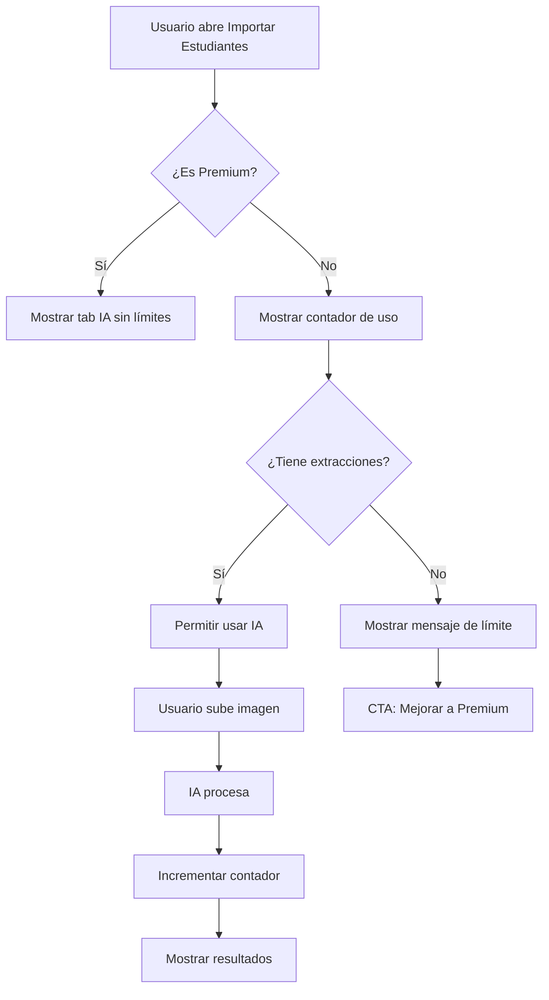

# 🎯 Sistema de Cuotas para Vicente Extractor (Plan Gratuito)

## Descripción

La función **Vicente Extractor** (importar estudiantes desde imágenes con IA) ahora está disponible para usuarios del plan gratuito con un **límite de 3 extracciones por mes**.

## Características Implementadas

### 1. **Límites por Tier**

#### Plan Gratuito
- ✅ **3 extracciones con IA por mes**
- ✅ El contador se reinicia automáticamente cada mes
- ✅ Indicador visual del uso restante
- ✅ Mensaje al alcanzar el límite con CTA a Premium

#### Plan Premium ($7/mes)
- ✅ **Extracciones ilimitadas**
- ✅ Sin contador visible
- ✅ Acceso completo a todas las funciones IA

### 2. **Tracking de Uso**

Se agregó un campo `usage` al tipo `UserSubscription`:

```typescript
interface UserSubscription {
  // ... existing fields
  usage?: {
    studentExtractions?: {
      count: number;           // Extracciones este mes
      lastReset: string;       // ISO string del último reset mensual
    };
  };
}
```

**Almacenamiento:** Firestore collection `subscriptions/{userId}`

### 3. **Lógica de Control**

#### En `SubscriptionContext.tsx`:
```typescript
canUseAI('studentExtraction') // Retorna:
  - true: Usuario Premium O usuario Free con extracciones disponibles
  - false: Usuario Free sin extracciones disponibles
```

**Proceso:**
1. Verifica si es Premium → acceso ilimitado ✅
2. Si es Free, verifica contador
3. Si es nuevo mes, permite uso (resetea en próxima extracción)
4. Si está bajo el límite (< 3), permite
5. Si alcanzó el límite (>= 3), bloquea

#### En `api.ts`:
Nueva función `trackStudentExtraction()`:
- Incrementa contador después de cada extracción exitosa
- Resetea contador si es un nuevo mes
- Crea documento subscription si no existe

### 4. **UI/UX**

#### Indicador Visual (Solo Free Users)
```
┌────────────────────────────────────────────┐
│ ✨ Extracciones IA este mes       2 / 3   │
└────────────────────────────────────────────┘
```

#### Mensajes Contextuales:
- **Sin extracciones**: "⚠️ Has alcanzado el límite mensual. Mejora a Premium para acceso ilimitado."
- **1 extracción restante**: "Te queda 1 extracción este mes..."
- **Premium**: Sin indicador (ilimitado)

### 5. **Flujo de Usuario**



---

## Archivos Modificados

### 1. `types.ts`
- ✅ Agregado campo `usage` a `UserSubsc ription`

### 2. `contexts/SubscriptionContext.tsx`
- ✅ Lógica especial para `studentExtraction` en `canUseAI()`
- ✅ Permite acceso a Free users con límite mensual

### 3. `services/api.ts`
- ✅ Nueva función `trackStudentExtraction()`
- ✅ Manejo de reset mensual automático

### 4. `components/StudentImportModal.tsx`
- ✅ Hook `getRemainingExtractions()` para calcular disponibles
- ✅ Llamada a `api.trackStudentExtraction()` después de extracción exitosa
- ✅ UI con contador visual para usuarios Free
- ✅ Mensajes contextuales según uso restante

### 5. `App.tsx`
- ✅ `studentExtraction: true` por defecto (gating por suscripción)

---

## Casos de Uso

### Caso 1: Usuario Free - Primera Extracción
1. Abre modal de importación
2. Ve contador: "3 / 3"
3. Sube imagen
4. IA extrae estudiantes ✅
5. Contador actualiza a: "2 / 3"

### Caso 2: Usuario Free - Última Extracción
1. Contador muestra: "1 / 3"
2. Mensaje: "Te queda 1 extracción este mes..."
3. Usa su última extracción
4. Contador: "0 / 3"
5. Mensaje: "⚠️ Has alcanzado el límite..."

### Caso 3: Usuario Free - Nuevo Mes
1. Fue 28 de febrero, contador en "0 / 3"
2. Llega 1 de marzo
3. Sistema detecta nuevo mes
4. Resetea contador a "3 / 3"
5. Usuario puede extraer nuevamente

### Caso 4: Usuario Premium
1. No ve contador
2. Extracción ilimitada
3. Sin tracking de cuota

---

## Ventajas del Sistema

### Para el Negocio
- 🎁 **Gancho freemium**: Usuarios prueban IA sin pagar
- 📈 **Conversión**: Límite incentiva upgrade a Premium
- 💡 **Valor percibido**: Usuarios ven utilidad antes de pagar
- 🔒 **Anti-abuso**: Previene uso excesivo gratuito

### Para el Usuario
- 🆓 **Prueba sin compromiso**: 3 usos gratis al mes
- ⚡ **Experiencia del producto**: Conocen IA Vicente
- 📊 **Transparencia**: Contador visible en todo momento
- 🎯 **Decisión informada**: Saben qué obtienen con Premium

---

## Próximos Pasos Sugeridos

### Mejoras Futuras
1. **Analytics**: Tracking de conversión Free → Premium
2. **Notificaciones**: Email cuando quedan 0 extracciones
3. **Ofertas**: Descuento al alcanzar límite
4. **Bonos**: "+1 extracción gratis" para referidos
5. **Variantes**: A/B testing de límites (2 vs 3 vs 5)

### Otras Funciones IA
Aplicar modelo similar a:
- Vicente Audio (transcripciones)
- Vicente Resume (informes)
- Planificar con Vicente (planes)

---

## Testing

### Probar como Free User
1. Crear/usar cuenta sin suscripción premium
2. Ir a **Importar Estudiantes → Tab IA**
3. Verificar contador aparece
4. Subir 3 imágenes diferentes
5. Confirmar que al 4to intento se bloquea
6. Verificar mensaje de límite aparece

### Probar como Premium User
1. Crear/usar cuenta con suscripción activa
2. Ir a **Importar Estudiantes → Tab IA**
3. Verificar que NO aparece contador
4. Verificar extracciones ilimitadas

### Probar Reset Mensual
1. En Firestore, modificar `lastReset` a mes anterior
2. Recargar app
3. Intentar extracción
4. Verificar que se permite y resetea contador

---

## Conclusión

Este sistema de cuotas proporciona un equilibrio perfecto entre:
- **Generosidad**: 3 usos gratuitos mensuales
- **Protección**: Límite previene abuso
- **Conversión**: Incentivo claro para upgrade
- **Experiencia**: Usuarios prueban antes de comprar

**Resultado**: Modelo freemium efectivo que incrementa conversión a Premium mientras mantiene satisfechos a usuarios gratuitos.
